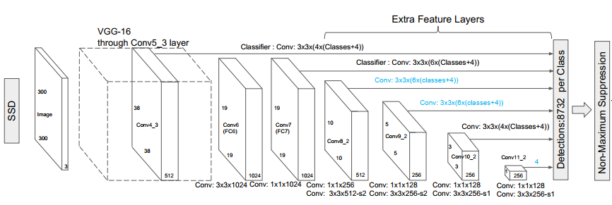

# Implement Single-shot-multibox-detector(SSD300) in PyTorch 


## ***Content***
1. [Enviroment](#enviroment)
2. [Dataset](#dataset)
3. [Model](#model)
4. [Loss function](#lossfunction)
5. [Train](#train)
6. [Detect](#detect)
7. [How to use this repo](#using)
## ***Enviroment***
*Python 3.8.11*

*PyTorch 1.9.0 on CUDA 10.2*

*Numpy 1.20.2*

*Matplotlib 3.3.4*

*OpenCV 4.0.1*

## ***Dataset***
Ta sử dụng bộ dataset Pascal Vitual Object Classes (VOC) 2007.
### *Giới thiệu*
Dataset bao gồm 5011 ảnh ở tập trainval và 4952 ảnh ở tập test.

Mỗi ảnh trong sẽ có 1 file annotations dạng .xml chứa tên ảnh, các bounding box và tên class tương ứng. 

Ở repo này ta sẽ sử dụng tập trainval để train mô hình và tập test sẽ được sử dụng để đánh giá độ chính xác qua thông số [mAP 0.5](https://jonathan-hui.medium.com/map-mean-average-precision-for-object-detection-45c121a31173).

Dataset gồm 20 classes: ["aeroplane", "bicycle", "bird",  "boat", "bottle", 
               "bus", "car", "cat", "chair", "cow", "diningtable",
               "dog", "horse", "motorbike", "person", "pottedplant",
               "sheep", "sofa", "train", "tvmonitor"]
được đánh index từ 1-20.

### *Data Pipeline*
Lấy id các ảnh từ tập ImageSets, đọc annotations và labels từ tập Annotations, ảnh từ tập JPEGImages.

Có thể thực hiện data augmentation bằng việc sử dụng class SSDAugmentation cho tập train và TestTransform cho tập test (tham khảo từ repo SSD của `amdegroot` và có hiệu chỉnh một chút) hoặc có thể dùng transform mà mình đã khai báo sẵn nếu không muốn dùng data augmentation.
### *Download*
<a href='https://www.kaggle.com/zaraks/pascal-voc-2007'>Pascal VOC 2007 on Kaggle </a>
## ***Model***

### *Base Convolutions*
See **Base** in [model.py](model.py).

Lớp này được xây dựng dựa trên cấu trúc của mô hình VGG16 với tham số khởi tạo được lấy từ pretrained weights trên tập ImageNet.

Hai layers fully-connected fc6 và fc7 được chuyển thành lớp convolutional layers `conv6`, `conv7`. Layer pool5 được chuyển từ 2x2 -s2 thành 3x3 - s1 và kết hợp thuật toán *à trous* cho lớp `conv6`. Layer fc8 bị loại bỏ. 

Return `conv4_3` cho lớp **Predictions** và `conv7` cho lớp **Extras**.

### *Extra Convolutional Layers*
See **Extras** in [model.py](model.py).

Ta sử dụng *uniform Xavier initilization* để khởi tạo tham số cho lớp này.

Return `conv8_2`, `conv9_2`, `conv10_2`, `conv11_2` cho lớp **Predictions**.
### *Prediction Convolutions*
See **Predictions** in [model.py](model.py).

Sử dụng các lớp `conv4_3`, `conv7`, `conv8_2`, `conv9_2`, `conv10_2`, `conv11_2` để xây dựng thành các convolutional layers dùng cho dự đoán vị trí (localizations), và class predictions.

Reshape các layers kết quả vừa rồi bằng hàm view, trước đó phải lưu chúng dưới dạng contiguous thì mới có thể reshape dc.

Cuối cùng, ta thu được 2 tensor kích thước (8732, 4) cho localization và (8732, 21) cho class predictions.
### *SSD300*
See *SSD300* in [model.py](model.py).

Ở đây, ta kết hợp 3 lớp phía trên lại để tạo thành mô hình SSD300 hoàn chỉnh. Do layer thấp `conv4_3` có khác biệt về tham số rõ rệt so với các layers cao hơn nên layer `conv4_3` sẽ đi qua lớp *L2 Normalization* với hệ số ban đầu là 20, hệ số này cũng sẽ được học qua mỗi lần train.


## ***LossFunction***
See *MultiBoxLoss* in [lossfunction.py](lossfunction.py).

*L1 loss* tính trên các boxes positive (có jaccard > 0.5).

*Crossentropy Loss* tính trên cả boxes positive và negative (được lấy thông qua [Hard Negative Mining](data/hard_negative_mining.png))


## ***Train***
See in [train.py](train.py).

Theo paper, tác giả train mô hình với batch_size = 32, hàm tối ưu SGD với learning_rate(lr) = 1e-3, momentum = 0.9, weight_decay = 5e-4 trong 30k iters, 10k iters với lr = 1e-4, 10k iters với lr = 1e-5.

Ở bài này, do giới hạn về tài nguyên GPU, mình sử dụng batch_size = 8, và giữ nguyên các hyperparameters ở trên.

## ***Detect***
See in [detect.py](detect.py).

Ở đây, ta detect lấy các boxes có min_score = 0.01, max_overlap = 0.45, top_k = 200 để tính mAP dựa trên repo [Object-Detection-Metrics](https://github.com/rafaelpadilla/Object-Detection-Metrics) của `rafaelpadilla`. 

Ngoài ra, ta cũng có thể đưa ảnh vào model và test trực tiếp.

## ***Using***

1. Download dataset PASCAL VOC 2007 với đường dẫn phía trên.
2. Clone repo này của mình.
``` 
git clone https://github.com/dvv3000/single-shot-multibox-detector.git
```
3. Clone repo Object_Detection-Metrics về cùng thư mục với repo của mình để tiện tính toán.
```
git clone https://github.com/rafaelpadilla/Object-Detection-Metrics.git
```
4. Download file weights mà mình đã train tại [đây]().
5. Sửa lại đường dẫn tới file weights mà bạn đã tải về và chạy file `detect.py` nếu muốn tính mAP, bạn hãy sử dụng hàm to_txt_file().
```
python detect.py
```
6. Tính mAP.
```
python pascalvoc.py -detformat xyrb -gtformat xyrb
```


